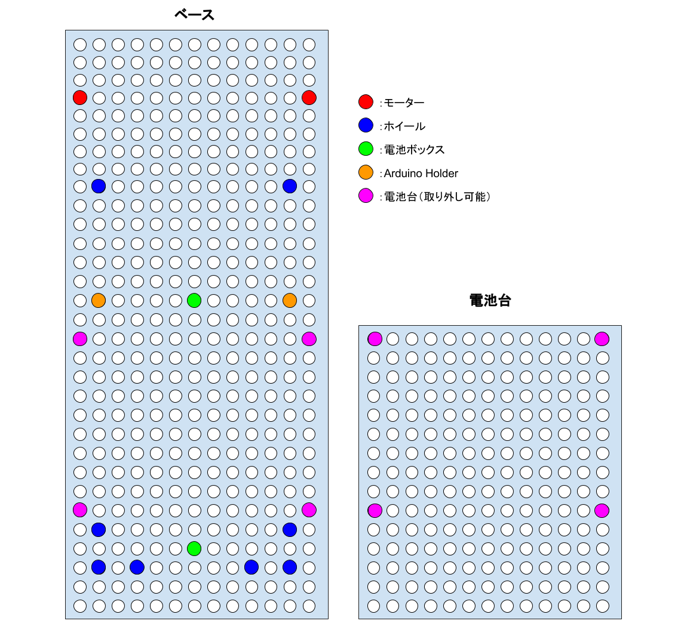
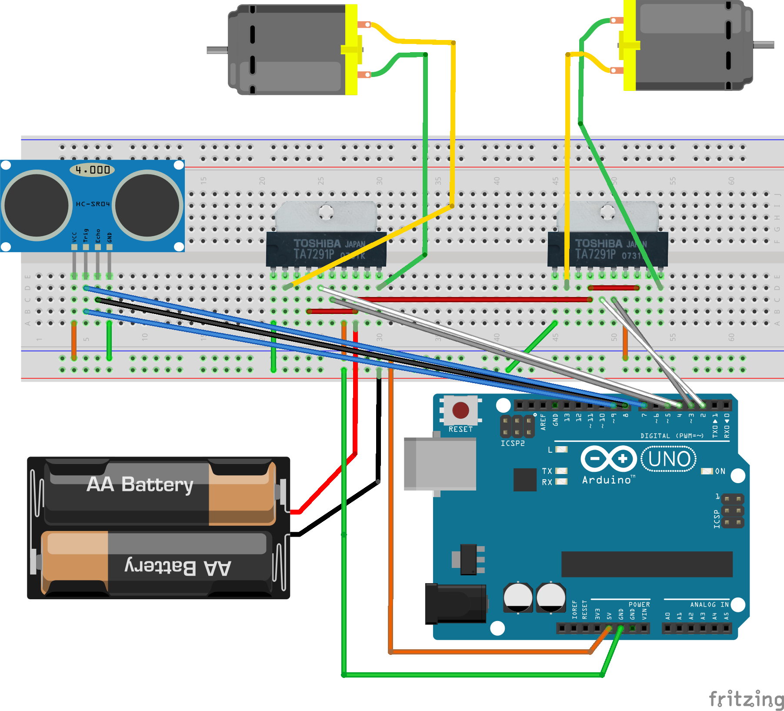

# DojoTank
[DojoCon Japan2016](http://dojocon.coderdojo.jp/)のBloclklyDuino体験ブースにて動かしていた戦車ロボ(DojoTank)の作り方などをまとめています。

## 内容
- SampleCode：BlocklyDuinoのサンプルコードが格納されてます
- Circuit：モータードライバとArduinoの接続に関する回路図
- Image：戦車ロボの各種画像

# 戦車ロボの構成部品
[部品リスト]

リストの一覧は、[こちら](https://docs.google.com/spreadsheets/d/1GFMyF7QKVoaPNvtzkHuXjzPc7Tc-55D2XxNh2L3xb0M/edit?usp=sharing)にまとめています。

## ベース
戦車を上下させるだけなら、通常の [タミヤ 楽しい工作シリーズ No.108 タンク工作基本セット ](http://amzn.to/2cnUZjh) で事足りますが、ロボットプログラミングを楽しむためには、ダブルギアにして左右に動かせるようにする必要があります。

また、ダブルギアの採用に伴い、横幅を確保できるユニバーサルプレートを加工しています。

- [タミヤ 楽しい工作シリーズ No.172 ユニバーサルプレートL 210×160mm](http://amzn.to/2bK1uIy) ✕ 1
- [タミヤ 楽しい工作シリーズ No.168 ダブルギヤボックス 左右独立4速タイプ](http://amzn.to/2bKeBOK) ✕ 1
- [タミヤ 楽しい工作シリーズ No.100 トラック&ホイールセット ](http://amzn.to/2bKexi0)

## モーターシールド
Arduinoでモーターコントロールさせるためには、モータードライバーなどの部品が必要になります。

巷で取り扱っているモーターシールドはいずれも5V以上の電源を要しており、戦車ロボにそれほどの電池をのせることが出来ませんでした。

できれば、コンパクトに単三２本（3V程度）で駆動させたかったため、悩んだ挙句、下記のICをハンダ付けして自分でモーターシールドを作成しました。

- [モータードライバー　ＴＡ７２９１Ｐ　（２個入）] (http://akizukidenshi.com/catalog/g/gI-02001/)  ✕ 1
- [Ａｒｄｕｉｎｏ用ユニバーサル基板　ガラスコンポジット（赤）](http://akizukidenshi.com/catalog/g/gP-09624/) ✕ 1
- [ターミナルブロック　２ピン（青）（縦）小](http://akizukidenshi.com/catalog/g/gP-01306/) ✕ 3
- [耐熱電子ワイヤー](http://akizukidenshi.com/catalog/g/gP-10672/) ✕ 1
- [ピンヘッダ　１×４０　（４０Ｐ）](http://akizukidenshi.com/catalog/g/gC-00167/) ✕ 1

## 固定
- [Arduino Holder Type Uno](http://akizukidenshi.com/catalog/g/gP-09397/) ✕ 1
- [六角オネジ・メネジ　ＭＢ３－３０](http://akizukidenshi.com/catalog/g/gP-07322/) ✕ 6
- M3-10mm（ナット付き） ✕ 22

## モータ用電源
モーターを駆動させるために、単三2本を使用します。
- [電池ボックス　単３×２本　リード線・耳付](http://akizukidenshi.com/catalog/g/gP-02679/) ✕ 1

## その他
### 距離センサー
もし、ロボットに距離センサーを付けたかったら、下記の商品を別途購入してください。

- [超音波距離センサー　ＨＣ－ＳＲ０４](http://akizukidenshi.com/catalog/g/gM-11009/) ✕ 1

### Arduino用電源
Arduinoは、モバイルバッテリーなどで電源を供給すればOKです。

もし、コンパクトな電源をお探しなら、下記のバッテリースナップと9Vの組み合わせがおすすめです。

- [２．１ｍｍＤＣプラグ付バッテリースナップ（縦型）](http://akizukidenshi.com/catalog/g/gP-07356/) ✕ 1

### Arduino Uno
制御には必要です。
もし、購入されるなら、永久保証のつくスイッチサイエンスさんで購入されることをオススメします。

- [Arduino Uno](http://amzn.to/2bK1YOV) ✕ 1

# 組み立て方法
下記の図面とこちらの[写真](https://goo.gl/photos/RhmUzpuK7QpetXwV8)を参考に組み立ててみてください。

## 配線
[配線図](./Circuit/tamiya-robo.fzz)を参考にしてください。

なお、図面データは、回路作成ソフトの [fritzing](http://fritzing.org/projects/) で作成しています。

### ピン配列
- D2 : TA7291P Motor1 IN1
- D3 : TA7291P Motor1 IN2
- D4 : TA7291P Motor2 IN1
- D5 : TA7291P MOTOR3 IN2
- D7 : HC-SR04 Trigger
- D8 : HC-SR04 Echo
- D9 : HC-SR04 Trigger
 
## サンプルコードの内容
前、後ろ、右、左、ストップ、フリーズの動きを関数化しています。
注意する点としては、フリーズの中に無限Loopを入れているので、STOPはその後何をやっても動作が止まってしまいます。

# ライセンス
この文書は [クリエイティブ・コモンズ 表示 – 継承 4.0 国際 ライセンス](https://creativecommons.org/licenses/by-sa/4.0/)の下に提供されています。